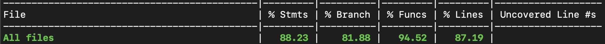
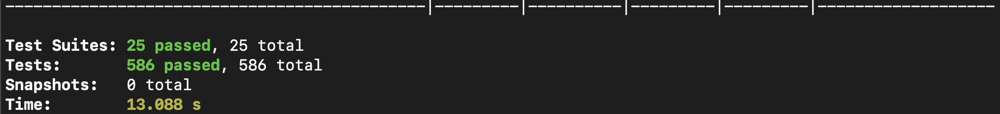

# 🏪 JAM Store API

## 📋 Descripción del Proyecto

**JAM Store API** es una API de pagos desarrollada con NestJS que implementa un sistema completo de procesamiento de transacciones financieras. La aplicación sigue la arquitectura **Domain-Driven Design (DDD)** y proporciona endpoints para:

- **Procesamiento de Pagos**: Creación y gestión de transacciones de pago
- **Gestión de Tarjetas**: Tokenización de tarjetas de crédito/débito
- **Estados de Transacción**: Seguimiento del estado de las transacciones
- **Integración con Pasarelas**: Conexión con servicios externos de pago

### 🏗️ Arquitectura

```
src/
├── domain/           # Entidades y lógica de negocio
├── application/      # Casos de uso y DTOs
├── infrastructure/   # Implementaciones concretas
└── shared/          # Utilidades compartidas
```

### 🚀 Tecnologías

- **Framework**: NestJS (Node.js)
- **Lenguaje**: TypeScript
- **Testing**: Jest
- **Arquitectura**: Domain-Driven Design (DDD)
- **Patrones**: Repository Pattern, Use Case Pattern

## 🛠️ Instalación y Configuración

### Prerrequisitos

- Node.js (versión 18 o superior)
- npm o yarn

### Instalación

```bash
# Clonar el repositorio
git clone <repository-url>
cd jam-store-api

# Instalar dependencias
npm install
```

### Variables de Entorno

Crear un archivo `.env` en la raíz del proyecto:

```env
# Configuración de la API de pagos
PAYMENT_PUBLIC_KEY=your_public_key_here
PAYMENT_INTEGRITY_SECRET=your_integrity_secret_here
PAYMENT_API_URL=https://api.payment-gateway.com
PAYMENT_TIMEOUT=30000
```

## 🚀 Ejecución del Proyecto

### Desarrollo

```bash
# Modo desarrollo
npm run start

# Modo watch (recompilación automática)
npm run start:dev
```

### Construcción

```bash
# Construir para producción
npm run build
```

## 🧪 Testing

### Ejecutar Tests

```bash
# Ejecutar todos los tests
npm test

# Ejecutar tests con coverage
npm run test:cov
```

## 📊 Test Coverage

### Resumen de Cobertura


### Tests Ejecutándose


---

**JAM Store API** - Sistema de pagos robusto y escalable construido con NestJS 🚀
